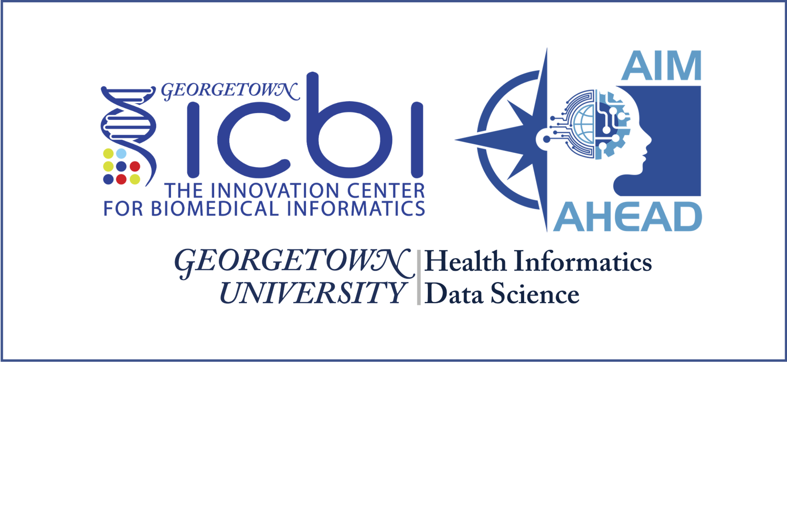

# Welcome to the AIM AHEAD at Georgetown University 

[The Innovation Center for Biomedical Informatics (ICBI)](https://icbi.georgetown.edu) at Georgetown University Medical Center is excited to be collaborating with Medstar Health and Georgetown University Biomedical Graduate Education (BGE) in the Data Science Training Core. This is part of a two-year, multimillion-dollar award funded by the National Institutes of Health (NIH). The initiative is one of the four core functions of the Artificial Intelligence/Machine Learning (AI/ML) Consortium to Advance Health Equity and Researcher Diversity Program [AIM-AHEAD](https://aim-ahead.net/home/about/what). Our teams are working to develop Artificial Intelligence and Machine Learning Training for Early Career and Minority Investigators Interested in Health Disparities. The official press release can be found [here](https://gumc.georgetown.edu/news-release/medstar-health-and-georgetown-university-medical-center-to-develop-ai-and-machine-learning-training/#_ga=2.202613521.142986531.1666014106-1590463721.1663162675).

### Heading 3
Plain text for heading 3 . 

#### Heading 4
Plain text for heading 4. 

*Italics text here* 

**Bold text here**

* Bullet point 1
* Bullet point 2
  - Bullet point 3
  

